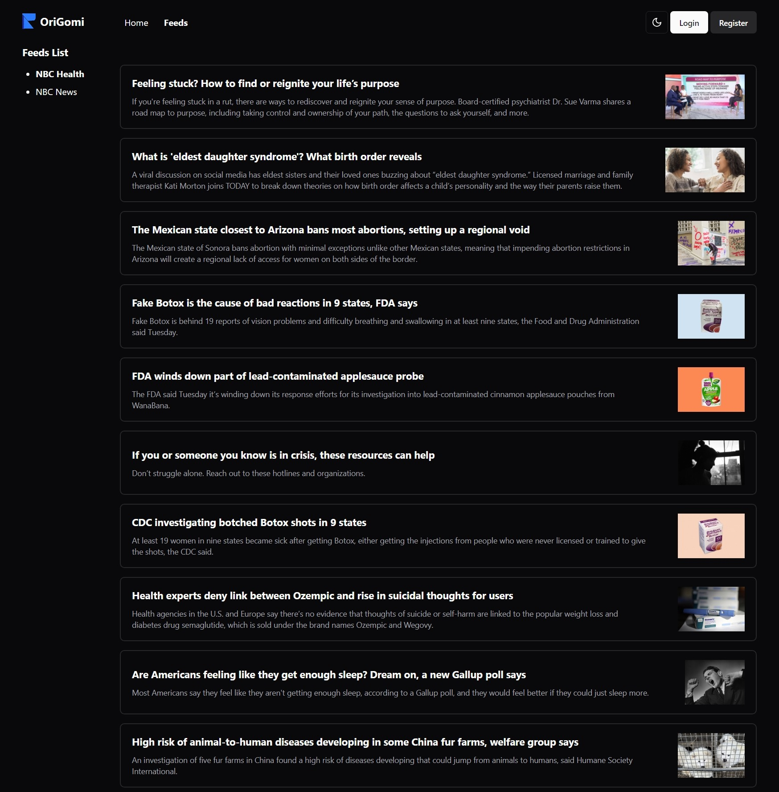
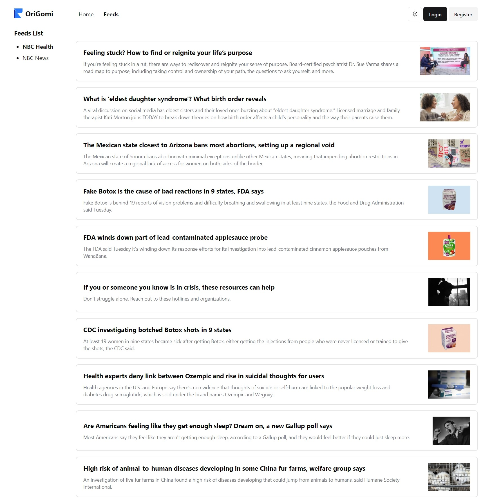
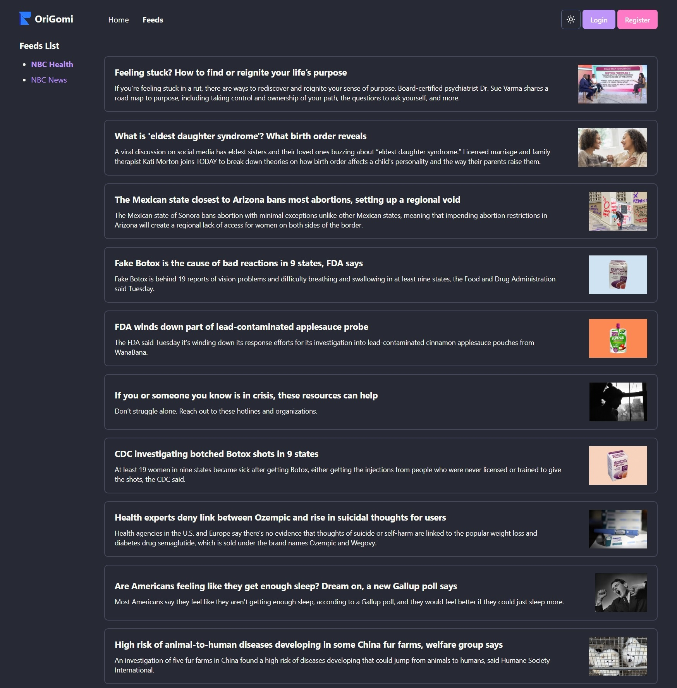

# RSS Reader

Front-end UI to display feeds/posts and manage users for [RSS Aggregator](https://github.com/tientrinh21/rssagg)

## Tech Used

- **Language:** TypeScript
- **Libraries:**
  - [React](https://react.dev/)
  - [Tailwind CSS](https://tailwindcss.com/)
  - [shadcn/ui](https://ui.shadcn.com/)
  - [Tanstack Router](https://tanstack.com/router/)
  - [React Query](https://tanstack.com/query/)
  - [React Host Toast](https://react-hot-toast.com/)

## Screenshots

This website come with three themes: Dark, Light and Dracula.

- **Dark**



- **Light**



- **Dracula**



## Features

- Login / Register
- Check feed lists
- See posts of a feed
- Add a feed source

## Quickstart
Create `.env` file and add the URL of the RSS Aggregator as `VITE_AGG_URL`.

For example:
```python
VITE_AGG_URL='http://localhost:8000/'
```
